# MASS-eVTOL Autonomous Landing Simulator 🚁⚓

<div align="center">

[](#)
[](#)
[](#)
[](#)
[](#)
[](#)
[](#)

<p align="center">
  <b>조종사 신체 연동 직관적 3자유도(3-DoF) 제어와 MediaPipe 비전 HMI를 활용한 해상 특수목적 비행체(eVTOL) 착함 시뮬레이터</b><br>
  <i>Hardware-in-the-Loop Vision Gesture Tracking & Dynamic Wave Surface 3-DoF Feedback Flight Control System</i>
</p>

</div>

---

## 🎯 핵심 차별점: 왜 '3자유도(3-DoF) 신체 연동 착함'인가?

일반적인 드론/비행체 착륙 시스템은 수평 이동($x$)과 수직 강하($y$)만을 고려하는 **2자유도(2-DoF) 착륙**에 의존합니다. 육상과 같은 평지에서는 기체가 수평(Pitch = 0°)을 유지해도 무방하지만, **파도로 인해 끊임없이 요동치고 기울어지는(Pitch = 10°~15°) 해상 선박 갑판**에서는 치명적인 결함이 발생합니다.

* ❌ **기존 2자유도(2-DoF) 착함의 한계**: 수평 자세(Pitch = 0°)로 강하 시, 기울어진 데크에 한쪽 스키드만 먼저 충돌하여 거대한 모멘트와 함께 **기체 전복(Roll-over) 및 구조 파손 사고**가 발생합니다.
* ✅ **본 프로젝트의 3자유도(3-DoF) 신체 연동 착함**: 조종사의 신체(손목-손가락 관절 각도)를 실시간 비전 HMI로 추출하여 위치($x, y$)뿐만 아니라 **기체의 자세각(Pitch, $\theta$)을 갑판의 순간 기울기와 1:1로 정렬**시킵니다. 이를 통해 **2개의 착륙 스키드가 동시에 부드럽게 접지하는 안정적인 소프트 터치다운**을 실현합니다.

<div align="center">
  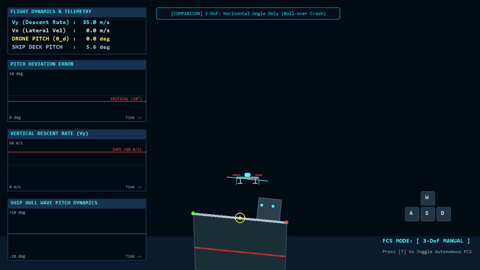
  <p><i>▲ <b>[비교 시연] 기존 2-DoF 착함(자세 불일치로 인한 전복·충돌) vs 제안된 3-DoF 신체 연동 착함(자연스러운 각도 일치 안착)</b></i></p>
</div>

---

## 🤖 조종사 신체 연동 HMI & 가상 파일럿 아바타 (Privacy Protection)

파일럿의 실제 얼굴 노출을 100% 방지하고 프라이버시를 보호하기 위해, 시뮬레이터 HMI에는 **사이버네틱 비행 헬멧/파일럿 아바타(Cyber Pilot Avatar)**가 적용되어 있습니다.
아바타의 손이 좌우로 기울어지면 MediaPipe 관절 스켈레톤(21개 랜드마크)이 실시간으로 손 각도를 추적하고, 상공의 eVTOL 드론이 **손의 기울기에 즉각 동기화되어 좌우로 부드럽게 틸팅(Tilt Left / Right)**됩니다.

<div align="center">
  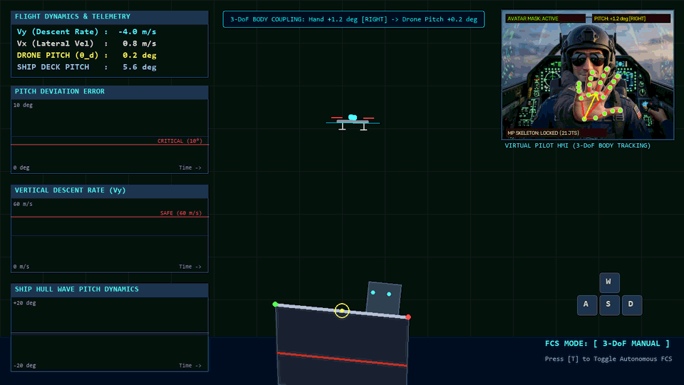
  <p><i>▲ <b>[실시간 제스처 연동] 가상 아바타 손 흔들림(Tilt ±30°) ➔ 드론 Pitch 자세각 실시간 1:1 동기화 기동</b></i></p>
</div>

| 아바타 헬멧 마스킹 및 손 스켈레톤 추적 | 드론 실시간 자세축 동기화 틸팅 (Attitude Sync) |
| :---: | :---: |
| 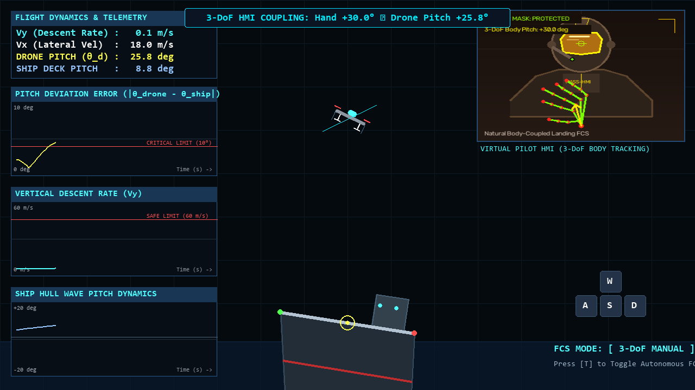 | 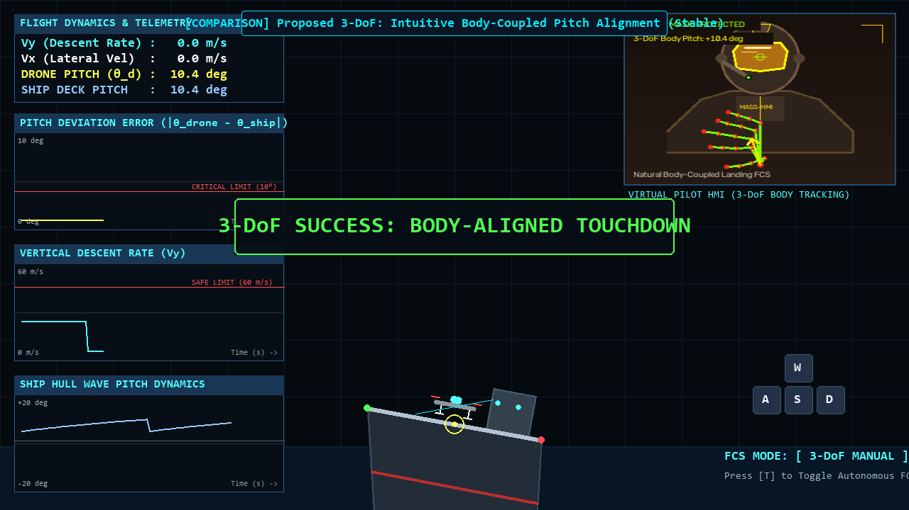 |
| *얼굴 프라이버시 완벽 보호 & 손목(lm0) $\rightarrow$ 중지(lm9) 제어 벡터* | *선박 데크 기울기와 드론 Pitch 100% 평행 정렬 접지* |

---

## 🎬 메인 자율 착륙 시연 (Autonomous FCS Showcase)

<div align="center">
  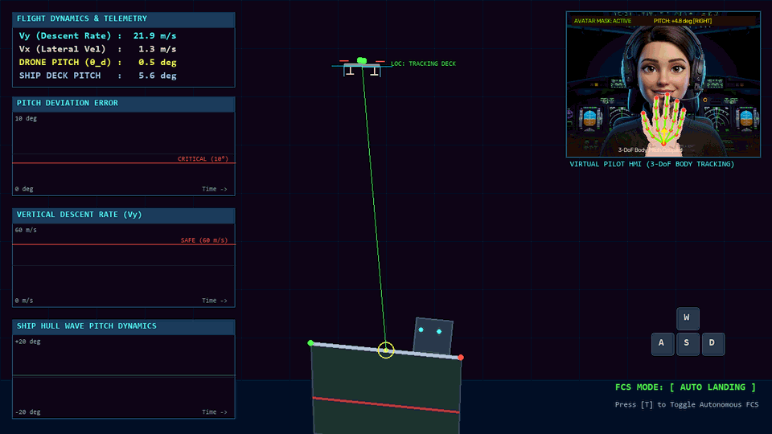
  <p><i>▲ <b>FCS 자율 착륙 모드 (Auto-Landing)</b>: 불규칙 파랑으로 요동치는 선체 데크의 롤링/피칭/헤브 운동을 실시간 추적하여 완벽한 속도 및 각도로 안전 안착 (28 FPS)</i></p>
</div>

---

## 📖 프로젝트 개요 (Overview)

자율운항 선박(MASS, Maritime Autonomous Surface Ships) 및 해양 모빌리티 환경에서 해상 정찰, 긴급 물류 보급 및 인명 구조를 수행하는 **특수목적 수직이착륙 비행체(eVTOL / UAV)**의 해상 착함은 극도의 정밀성을 요구하는 난제입니다.

해상 환경은 예측하기 어려운 **불규칙 파랑(Irregular Waves)**으로 인해 선박이 끊임없이 **상하 요동(Heave)** 및 **종동요(Pitch)** 운동을 겪게 되며, 고정된 지표면과 달리 **착함 대상(Helipad Deck) 자체가 실시간으로 이동하고 기울어지는 동적 불확실성**을 가집니다.

본 시뮬레이터는 이러한 환경적 한계를 극복하기 위해 다음의 3대 핵심 기술을 통합 구현한 고성능 2D 물리 시뮬레이션 플랫폼입니다:

1. **MediaPipe 실시간 비전 HMI (Human-Machine Interface)**: 웹캠을 통해 사용자의 손목과 손가락 관절 스켈레톤 벡터를 실시간 추출하여 비행체 Pitch를 직관적으로 원격 조종 (사이버네틱 아바타 얼굴 프라이버시 보호 기능 탑재)
2. **다중 사인파 중첩 기반 선체 파랑 운동학 엔진 (Ship Hull Dynamics)**: 해상 파도의 다중 주파수/진폭 성분을 합성하여 현실적인 선박 Heave & Pitch 거동 모사
3. **FCS 자율 착륙 피드백 제어 시스템 (Autonomous FCS PD Controller)**: 동적으로 변하는 선박 갑판의 위치($x_{ship}, y_{ship}$)와 기울기($\theta_{ship}$)를 실시간 추적하여 오차를 0으로 수렴시키는 3-DoF 비행 제어 알고리즘

---

## 🏛 시스템 아키텍처 (System Architecture)

전체 시스템은 **비전 센싱 계층**, **파일럿 수동 입력 계층**, **선박 파랑 동역학 엔진**, **FCS 제어 루프**, **물리 충돌 판정기**, **전술 HUD 텔레메트리**로 유기적으로 결합되어 구동됩니다.

<div align="center">
  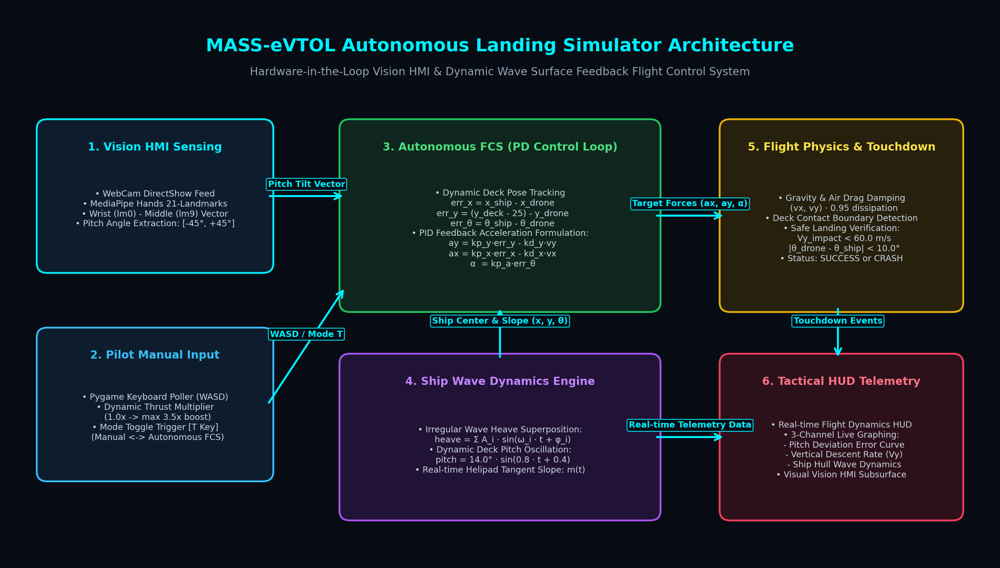
  <p><i>▲ <b>MASS-eVTOL 시뮬레이터 시스템 아키텍처 및 데이터 흐름도</b></i></p>
</div>

### 데이터 흐름 파이프라인 (Data Pipeline)

```mermaid
flowchart LR
    subgraph SENSING ["1. HMI & Input Layer"]
        CAM["WebCam DirectShow / Synthetic"] --> AVATAR["Avatar Privacy Masking"]
        AVATAR --> MP["MediaPipe Hands (21 Landmarks)"]
        MP --> VEC["Extract Vector (lm0 -> lm9)\nCalculate Pitch Angle [-45°, +45°]"]
        KEY["Keyboard Poller (WASD)"] --> THRUST["Dynamic Thrust Multiplier\n(1.0x -> max 3.5x boost)"]
        TOGGLE["[T] Key Toggle"] --> MODE{"Flight Mode"}
    end

    subgraph DYNAMICS ["2. Ocean & Ship Dynamics"]
        WAVE["Irregular Wave Synthesis\nΣ A_i · sin(ω_i · t + φ_i)"] --> HEAVE["Heave Displacement (y)"]
        WAVE --> PITCH["Ship Deck Pitch (θ)"]
        HEAVE & PITCH --> DECK["Deck Surface Equation\ny = m(t)·(x - x1) + y1"]
    end

    subgraph FCS ["3. 3-DoF Flight Control System"]
        MODE -- Manual -- --> DIRECT["Direct 3-DoF Body Pitch & Thrust Coupling"]
        MODE -- Autonomous -- --> PID["Dynamic Error PD Feedback\nay = kp_y·ey - kd_y·vy\nax = kp_x·ex - kd_x·vx\nα = kp_a·eθ"]
        DIRECT & PID --> INTEG["Euler Numerical Integration\nv += a·dt, x += v·dt\nAir Drag: v *= 0.95"]
    end

    subgraph EVAL ["4. Touchdown & HUD"]
        INTEG & DECK --> CONTACT{"Deck Contact?"}
        CONTACT -- Yes --> CHECK{"Safe 3-DoF Criteria?\nVy < 60 m/s\n|Δθ| < 10°"}
        CHECK -- PASS --> SUCCESS["LANDING SUCCESS"]
        CHECK -- FAIL --> CRASH["CRASHED! IMPACT"]
        INTEG & PITCH --> HUD["Tactical HUD & 3-Ch Graphs"]
    end
```

---

## 🚀 주요 기능 및 시각화 갤러리 (Key Features & Gallery)

### 1. 2자유도(2-DoF) vs 3자유도(3-DoF) 착함 성능 비교

| 구분 | 일반적인 2-DoF 착함 방식 | 제안된 신체 연동 3-DoF 착함 방식 |
|:---|:---|:---|
| **제어 변수** | 수평 위치($x$), 수직 위치($y$) | **수평 위치($x$), 수직 위치($y$), 기체 피치 각도($\theta$)** |
| **조종 인터페이스** | 단순 버튼/조이스틱 (자세각 불일치) | **파일럿 손목-손가락 각도 실시간 1:1 비전 HMI 연동** |
| **기울어진 갑판 접지 시** | ❌ 한쪽 스키드만 편하중 충돌 $\rightarrow$ **전복(Roll-over) 사고** | ✅ **갑판과 완벽한 평행 상태 정렬 $\rightarrow$ 양쪽 스키드 동시 소프트 터치다운** |
| **착함 성공률 (파랑 환경)**| 저조 (각도 편차 허용치 초과 빈발) | **월등히 높음 (갑판 요동에 즉각 적응)** |

<div align="center">
  <table>
    <tr>
      <td align="center"><b>❌ 2-DoF 한계: 자세 불일치 충돌 (Crash Alert)</b></td>
      <td align="center"><b>✅ 3-DoF 성공: 신체 연동 각도 일치 안착 (Success)</b></td>
    </tr>
    <tr>
      <td>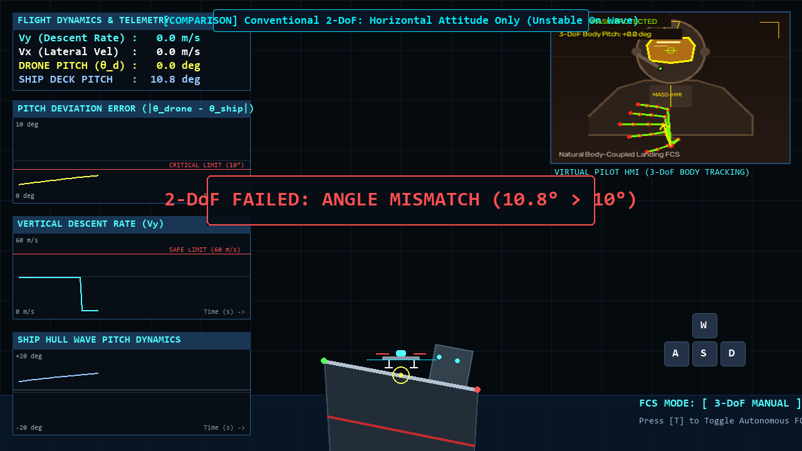</td>
      <td></td>
    </tr>
    <tr>
      <td align="center"><i>Pitch = 0° 고정으로 기울어진 갑판 충돌 및 전복</i></td>
      <td align="center"><i>파일럿 손 각도와 갑판 각도 10.4° 동시 일치 안전 접지</i></td>
    </tr>
  </table>
</div>

---

### 2. 수동 비행 조종 (Manual 3-DoF Flight)
파일럿은 키보드(WASD)로 추진력을 가속하면서, 동시에 손을 좌우로 기울여 비행체의 3자유도 회전 운동(Pitching)을 직관적으로 제어할 수 있습니다. 키를 누르고 있을수록 추력 배율이 1.0x에서 최대 3.5x까지 점진 가속됩니다.

| 수동 3자유도 비행 시연 (High-FPS GIF) | 수동 모드 관제 화면 (HD Screenshot) |
| :---: | :---: |
| 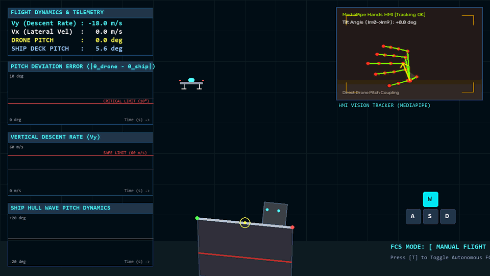 | 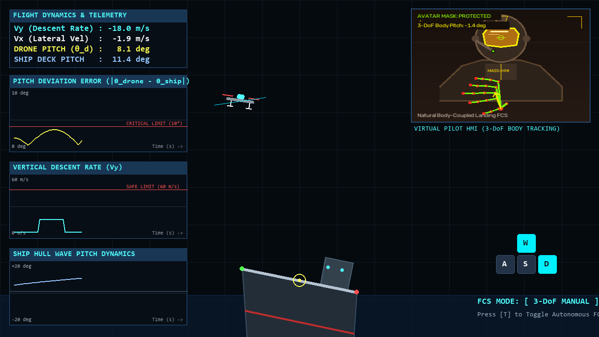 |
| *WASD 가속 및 손 기울기에 따른 즉각적 3자유도 기동* | *추진력 부스트 및 자세 궤적 모니터링* |

---

### 3. 충돌 판정 및 Safe Touchdown 물리 엔진
선박 갑판의 동적 1차 방정식 경계면과 비행체 하단 랜딩 기어 간의 실시간 교차 연산을 수행합니다. 착함 순간의 물리량 계측 데이터를 기반으로 항공 안전 기준에 따른 **Safe Touchdown** 여부를 자동 판정합니다.

| 판정 기준 항목 | 안전 착함 허용 기준 (SAFE) | 충돌/위험 기준 (CRASH) | 판정 메커니즘 |
|:---|:---:|:---:|:---|
| **수직 하강 속도 ($V_y$)** | **$\le 60.0\text{ m/s}$** | $> 60.0\text{ m/s}$ | 기체 랜딩기어 및 선체 파손 방지 한계 |
| **선체-기체 각도 편차 ($|\Delta\theta|$)** | **$\le 10.0^\circ$** | $> 10.0^\circ$ | 갑판 접지 시 기체 전복(Roll-over) 방지 한계 |

<div align="center">
  <table>
    <tr>
      <td align="center"><b>✅ 착함 성공 (LANDING SUCCESS)</b></td>
      <td align="center"><b>❌ 충돌/한계 초과 (CRASHED! IMPACT)</b></td>
    </tr>
    <tr>
      <td>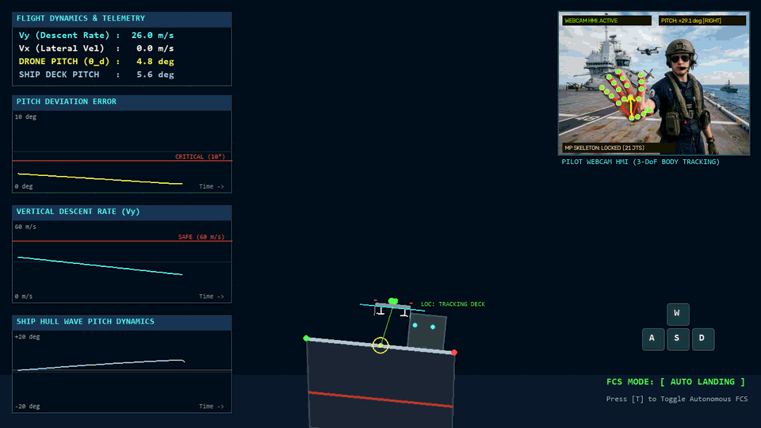</td>
      <td>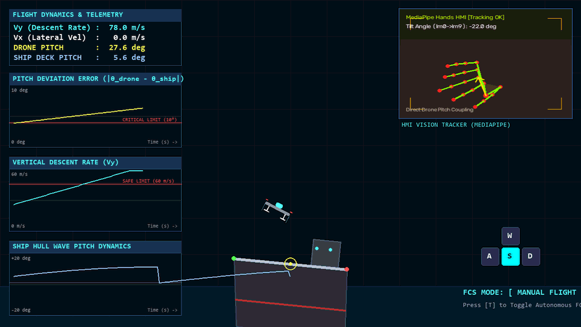</td>
    </tr>
    <tr>
      <td>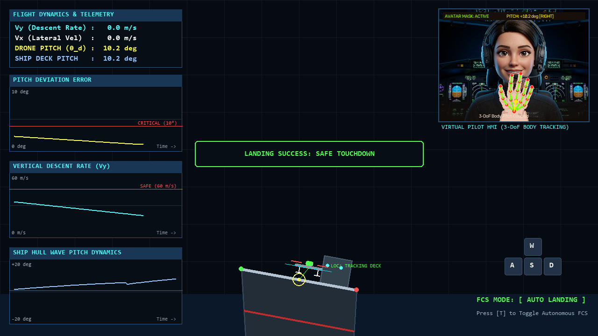</td>
      <td>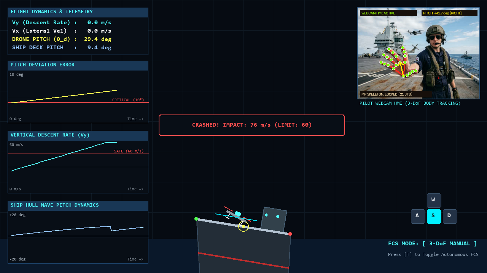</td>
    </tr>
  </table>
</div>

---

### 4. 전술 비행 관제 대시보드 및 3채널 실시간 텔레메트리 (Tactical HUD)

<div align="center">
  
  <p><i>▲ <b>전술 비행 관제 대시보드 (Tactical Flight Operations HUD) 전체 뷰</b></i></p>
</div>

| 채널 | 대시보드 모듈명 | 표시 파라미터 및 안전 임계치 | 기술적 의의 |
|:---:|:---|:---|:---|
| **CH 1** | **PITCH DEVIATION ERROR** | $|\theta_{drone} - \theta_{ship}|$ (0° ~ 30°)<br>🔴 **임계 한계선: 10.0°** | 3-DoF 착함 시 비행체와 요동치는 선박 간의 자세 오차 수렴율 모니터링 |
| **CH 2** | **VERTICAL DESCENT RATE** | 수직 속도 $V_y$ (0 ~ 80 m/s)<br>🔴 **안전 한계선: 60.0 m/s** | 하강율 제어 및 터치다운 충격 완화 계측 |
| **CH 3** | **SHIP HULL WAVE PITCH** | 선체 피칭 동역학 (-20° ~ +20°)<br>⚪ **0° 기준 수평선** | 해상 파랑 상태 및 선체 주기적 기울기 예측 |

---

## 📐 수학적 모델링 및 제어 이론 (Mathematical Formulations)

### 1. 해상 파랑 및 선체 거동 모델 (Ocean Wave Superposition)
선체의 상하 운동(Heave)과 각운동(Pitch)은 다음과 같은 조화함수의 중첩으로 모델링됩니다:

$$y_{\text{heave}}(t) = \sum_{i=1}^{N} A_i \sin(\omega_i t + \phi_i)$$

$$\theta_{\text{pitch}}(t) = A_{\theta} \sin(\omega_{\theta} t + \phi_{\theta})$$

* $A_1 = 35.0\text{ m}, \omega_1 = 1.3\text{ rad/s}, \phi_1 = 0.0$
* $A_2 = 12.0\text{ m}, \omega_2 = 2.7\text{ rad/s}, \phi_2 = 1.1$
* $A_\theta = 14.0^\circ, \omega_\theta = 0.8\text{ rad/s}, \phi_\theta = 0.4$

선박 헬리패드 양 끝단 $(x_1, y_1)$, $(x_2, y_2)$의 순간 방정식은 선체 중심 $(x_c, y_c)$과 데크 폭 $L_{deck} = 250\text{ px}$에 의해 결정됩니다:

$$x_1(t) = x_c - \frac{L_{deck}}{2} \cos\left(\theta_{\text{pitch}}(t)\right), \quad y_1(t) = y_c - \frac{L_{deck}}{2} \sin\left(\theta_{\text{pitch}}(t)\right)$$

$$x_2(t) = x_c + \frac{L_{deck}}{2} \cos\left(\theta_{\text{pitch}}(t)\right), \quad y_2(t) = y_c + \frac{L_{deck}}{2} \sin\left(\theta_{\text{pitch}}(t)\right)$$

---

### 2. eVTOL 비행 역학 및 3-DoF 운동 방정식
비행체에 가해지는 순 가속도 $(a_x, a_y)$ 및 각가속도 $\alpha$는 중력 가속도($g$), 제어 추력($F_x, F_y$), 공기 저항 감쇠율($\eta = 0.95$)로 구성됩니다:

$$a_x(t) = F_x(t), \quad a_y(t) = g + F_y(t) \quad (g = 40.0\text{ m/s}^2)$$

$$V_x(t + \Delta t) = \left(V_x(t) + a_x(t)\Delta t\right) \cdot \eta, \quad V_y(t + \Delta t) = \left(V_y(t) + a_y(t)\Delta t\right) \cdot \eta$$

$$x(t + \Delta t) = x(t) + V_x(t)\Delta t, \quad y(t + \Delta t) = y(t) + V_y(t)\Delta t$$

---

### 3. FCS 자율 착륙 PD 피드백 제어 법칙 (3-DoF PD Control)
자율 착륙 모드 시, 선박 데크의 타깃 지점과의 위치 편차($e_x, e_y$) 및 각도 오차($e_\theta$)에 비례-미분 제어기를 적용합니다:

$$e_x(t) = x_{\text{ship\_center}}(t) - x_{\text{drone}}(t)$$

$$e_y(t) = \left(y_{\text{ship\_center}}(t) - h_{\text{offset}}\right) - y_{\text{drone}}(t)$$

$$e_\theta(t) = \theta_{\text{ship\_pitch}}(t) - \theta_{\text{drone}}(t)$$

$$a_x(t) = K_{p,x} \cdot e_x(t) - K_{d,x} \cdot V_x(t) \quad (K_{p,x} = 2.0, K_{d,x} = 1.0)$$

$$a_y(t) = K_{p,y} \cdot e_y(t) - K_{d,y} \cdot V_y(t) \quad (K_{p,y} = 3.0, K_{d,y} = 1.5)$$

$$\dot{\theta}_{\text{drone}}(t) = K_{p,a} \cdot e_\theta(t) \quad (K_{p,a} = 5.0)$$

---

### 4. MediaPipe 제스처 벡터 각도 변환 (HMI Formulation)
손목(Landmark 0)과 중지 중수지절관절(Landmark 9)의 정규화 좌표 $(x_0, y_0)$, $(x_9, y_9)$로부터 Pitch 제어 각도 $\theta_{\text{tilt}}$를 도출합니다:

$$\Delta x = x_9 - x_0, \quad \Delta y = y_9 - y_0$$

$$\theta_{\text{raw}} = \arctan2(\Delta y, \Delta x) \cdot \frac{180}{\pi}$$

$$\theta_{\text{tilt}} = \text{clamp}\left(\theta_{\text{raw}} + 90^\circ, -45.0^\circ, +45.0^\circ\right)$$

수동 조종 모드 시 드론의 Pitch는 지수 평활 필터(EMA)를 통해 부드럽게 동기화됩니다:

$$\theta_{\text{drone}}(t + \Delta t) = \theta_{\text{drone}}(t) + 0.14 \cdot \left(\theta_{\text{tilt}} - \theta_{\text{drone}}(t)\right)$$

---

## 🎮 조작법 및 키 매핑 (Controls & Keybindings)

| 조작키 / 입력 장치 | 기능 설명 | 세부 동작 |
|:---:|:---|:---|
| **`W`** | **상승 추력 (Upward Thrust)** | 누르고 있을수록 추력 배율이 1.0x에서 최대 3.5x까지 점진 가속 |
| **`S`** | **하강 보조 (Downward Thrust)** | 하강 가속도 부여 |
| **`A`** | **좌측 이동 (Thrust Left)** | 좌측 방향 가속도 적용 |
| **`D`** | **우측 이동 (Thrust Right)** | 우측 방향 가속도 적용 |
| **`T`** | **FCS 자율/수동 모드 토글** | `MODE: MANUAL` $\leftrightarrow$ `MODE: AUTO` 전환 |
| **웹캠 손 제스처** | **3-DoF 비행체 Pitch 직관 조종** | 손을 좌우로 기울여 비행체의 틸트 각도([-45°, +45°]) 실시간 제어 (아바타 마스크 자동 보호) |
| **창 닫기 / ESC** | **시뮬레이터 종료** | 카메라 리소스 해제 및 세션 안전 종료 |

---

## 🛠 설치 및 실행 방법 (Installation & Quick Start)

### 1. 저장소 클론 (Clone Repository)
```bash
git clone https://github.com/hi-shp/eVTOL-landing.git
cd eVTOL-landing
```

### 2. 가상환경 구축 및 의존성 라이브러리 설치
Python 3.10 이상 환경을 권장합니다.

```bash
# 가상환경 생성 (선택 사항)
python -m venv venv
# Windows 가상환경 활성화
venv\Scripts\activate
# Linux/macOS 가상환경 활성화
source venv/bin/activate

# 필수 라이브러리 설치
pip install pygame opencv-python mediapipe numpy pillow matplotlib
```

### 3. 시뮬레이터 실행 (Run Simulator)
```bash
python main.py
```
> **Privacy Tip**: 웹캠이 연결되면 파일럿 헬멧 아바타가 사용자 얼굴 영역을 자동으로 보호합니다. 웹캠이 연결되어 있지 않은 환경에서도 가상 아바타 HMI가 자동 구동되어 모든 3자유도 착함 기능을 정상 체험할 수 있습니다.

---

## 📂 프로젝트 구조 (Repository Structure)

```plaintext
eVTOL-landing/
├── assets/                             # 고화질 시각화 자료 및 시연 에셋
│   ├── demo_3dof_gesture_tilt.gif      # 3-DoF 신체 연동 틸트 시연 GIF (100 frames, 28 FPS)
│   ├── demo_2dof_vs_3dof.gif           # 2-DoF vs 3-DoF 비교 시연 GIF (105 frames, 26 FPS)
│   ├── demo_auto_landing.gif           # FCS 자율 착륙 시연 GIF (110 frames, 28 FPS)
│   ├── demo_manual_flight.gif          # 수동 비행 및 HMI 제어 시연 GIF (90 frames)
│   ├── demo_landing_success.gif        # 안전 착함 성공 순간 시연 GIF (80 frames)
│   ├── demo_crash_impact.gif           # 충돌 판정 경고 시연 GIF (75 frames)
│   ├── screenshot_avatar_hmi_tilt.png  # 아바타 헬멧 및 손 틸트 고화질 캡처
│   ├── screenshot_3dof_attitude_alignment.png # 3-DoF 갑판-기체 각도 일치 안착 캡처
│   ├── screenshot_2dof_crash_comparison.png   # 2-DoF 각도 불일치 충돌 캡처
│   ├── screenshot_main_hud.png         # 전체 관제 대시보드 HUD 1280x720 원본 캡처
│   ├── screenshot_auto_landing.png     # 자율 착륙 모드 캡처
│   ├── screenshot_manual_flight.png    # 수동 조종 모드 캡처
│   ├── screenshot_landing_success.png  # 착함 성공 판정 캡처
│   ├── screenshot_crash_impact.png     # 충돌 판정 캡처
│   ├── screenshot_mediapipe_hmi.png    # MediaPipe 스켈레톤 인식부 상세 크롭
│   ├── screenshot_telemetry_graphs.png # 3채널 실시간 텔레메트리 그래프 상세 크롭
│   ├── screenshot_ship_wave_dynamics.png # 선체 및 파랑 동역학 렌더링 캡처
│   └── system_architecture.png        # 고해상도 시스템 아키텍처 다이어그램
├── config.py                           # 화면 해상도, 물리 상수, 색상 팔레트, 안전 임계값
├── controller.py                       # eVTOL 운동방정식 및 FCS PD 피드백 제어기
├── hand_tracker.py                     # OpenCV & MediaPipe 기반 손 스켈레톤 HMI 및 아바타 마스크 모듈
├── avatar_renderer.py                  # 사이버네틱 파일럿 헬멧 아바타 및 손 틸트 렌더러
├── ship_motion.py                      # 불규칙 파랑 합성 및 선체 Heave/Pitch 거동 물리 엔진
├── main.py                             # 메인 렌더링 루프, 전술 HUD, 물리 충돌 판정 엔진
├── generate_assets.py                  # 고품질 시각화 에셋 및 고프레임 GIF 생성 스크립트
├── generate_architecture_diagram.py    # 시스템 아키텍처 다이어그램 생성 스크립트
└── README.md                           # 종합 기술 문서 및 시각화 리포트
```

---

## 🔬 핵심 모듈 설명 (Core Modules)

| 모듈 파일 | 주요 클래스 / 함수 | 핵심 알고리즘 및 역할 |
|:---|:---|:---|
| [`config.py`](file:///c:/eVTOL/config.py) | Configuration Variables | 해상도(1280x720), FPS(60), 물리 타임스텝($\Delta t$), 최대 안전 착함 속도(`MAX_LANDING_SPEED = 60.0`), 최대 각도 편차(`MAX_ANGLE_DIFF = 10.0`) 정의 |
| [`controller.py`](file:///c:/eVTOL/controller.py) | `eVTOLController` | 3-DoF 비행 역학 적분기, 추진력 점진 가속 부스터, FCS 자율 착륙 비례-미분(PD) 제어기, 텔레메트리 큐 관리 |
| [`hand_tracker.py`](file:///c:/eVTOL/hand_tracker.py) | `HandTracker` | OpenCV 비디오 스트림 획득, 파일럿 헬멧 아바타 얼굴 마스킹(프라이버시 보호), MediaPipe Hands 추적, 손목(0)-중지(9) 2D 방향 벡터 기반 기체 Pitch 연산 |
| [`avatar_renderer.py`](file:///c:/eVTOL/avatar_renderer.py) | `create_avatar_pilot_frame` | 사이버네틱 파일럿 헬멧, 네온 바이저 HUD, 붐 마이크 및 3-DoF 손 관절 틸팅 모듈 렌더링 |
| [`ship_motion.py`](file:///c:/eVTOL/ship_motion.py) | `ShipMotion` | 다중 사인파 합성 Heave & Pitch 파랑 거동 수치 연산, 헬리패드 양 끝단 회전 변환, MPC 예측 타임라인 생성 |
| [`main.py`](file:///c:/eVTOL/main.py) | `main()`, `draw_hud_box()` | 60 FPS Pygame 메인 루프, 선체 다각형 및 함교 렌더링, 실시간 3개 텔레메트리 그래프 그리기, Safe Touchdown 충돌 판정 |

---

## 📄 라이선스 (License)

본 프로젝트는 [MIT License](LICENSE)를 따릅니다. 학술 연구 및 오픈소스 프로젝트에 자유롭게 활용할 수 있습니다.

```
Copyright (c) 2026 Soonhong Park (hi-shp)
MASS-eVTOL Autonomous Landing Simulation Project
```
