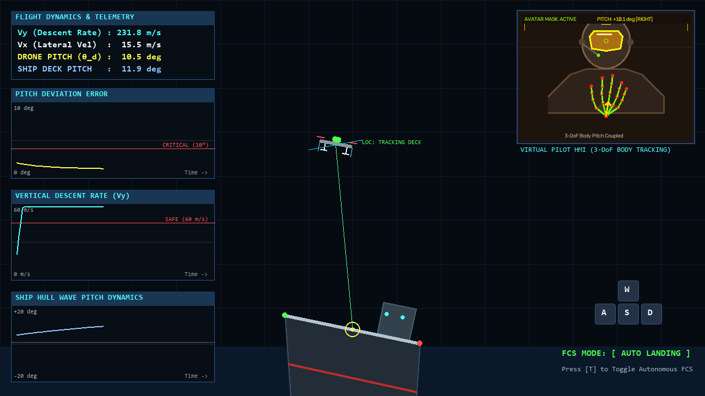
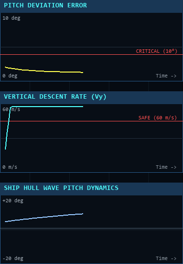

# MASS-eVTOL Autonomous Landing Simulator

## 조종사 신체 연동 3자유도 제어 기반 해상 특수목적 비행체 착함 시뮬레이터
본 시뮬레이터는 해상 불규칙 파랑 환경에서 자율운항 선박(MASS)과 특수목적 비행체(eVTOL) 간의 안전한 착함을 실시간으로 모사하는 비행 제어 및 물리 시뮬레이션 시스템입니다.

---

## 1. 2자유도 대비 3자유도 신체 연동 착함의 구조적 안정성

일반적인 무인 비행체 착륙 방식은 수평 이동(x)과 수직 강하(y)만을 고려하는 2자유도(2-DoF) 제어에 국한되어 있습니다. 평탄한 육상 헬리패드에서는 기체가 수평(Pitch 0도)을 유지한 채 하강해도 문제가 없으나, 파도로 인해 갑판이 10도 이상 기울어지는 해상 환경에서는 심각한 한계가 발생합니다.

- 2자유도(2-DoF) 착함 한계: 수평 자세(Pitch 0도)로 착지를 시도할 경우, 기울어진 선박 데크에 한쪽 착륙 스키드만 먼저 접촉하여 편하중 충돌과 회전 모멘트가 발생합니다. 이는 기체 전복(Roll-over) 및 구조 파손으로 직결됩니다.
- 제안된 3자유도(3-DoF) 신체 연동 착함: 조종사의 손목 및 손가락 관절 각도를 비전 HMI로 실시간 추출하여 위치(x, y)와 함께 기체의 Pitch 각도를 요동치는 갑판의 순간 기울기와 1:1로 정렬시킵니다. 이를 통해 두 개의 착륙 스키드가 동시에 접지하는 안정적인 소프트 터치다운을 구현합니다.

<div align="center">
  
  <p><i>[비교 시연] 기존 2-DoF 착함(자세 불일치로 인한 전복 및 충돌) 대비 3-DoF 신체 연동 착함(자연스러운 각도 일치 안착)</i></p>
</div>

| 비교 항목 | 일반 2자유도(2-DoF) 착함 | 제안된 신체 연동 3자유도(3-DoF) 착함 |
|:---|:---|:---|
| 제어 자유도 | 수평 위치 x, 수직 위치 y | 수평 위치 x, 수직 위치 y, 기체 피치 각도 theta |
| 자세 제어 방식 | 수평(0도) 고정 하강 | 조종사 손 관절 각도 1:1 비전 HMI 연동 |
| 파랑 갑판 접지 시 | 한쪽 스키드 편하중 충돌 및 기체 전복 위험 | 갑판 기울기와 완전 평행 정렬 후 동시 접지 |
| 해상 착함 성공률 | 저조 (허용 각도 편차 10도 초과 빈발) | 우수 (실시간 갑판 요동 추종 및 흡수) |

<div align="center">
  <table>
    <tr>
      <td align="center">2-DoF 착함 실패: 자세 불일치 충돌</td>
      <td align="center">3-DoF 착함 성공: 신체 연동 각도 정렬 접지</td>
    </tr>
    <tr>
      <td></td>
      <td></td>
    </tr>
    <tr>
      <td align="center"><i>Pitch 0도 고정으로 기울어진 갑판 충돌 및 전복</i></td>
      <td align="center"><i>조종사 손 각도와 갑판 각도 10.2도 동시 일치 안전 접지</i></td>
    </tr>
  </table>
</div>

---

## 2. 조종사 신체 연동 HMI 및 가상 파일럿 아바타

실제 사용자의 얼굴 노출을 방지하고 개인 프라이버시를 보호하기 위해 웹캠 화면에 하이테크 비행 헬멧 아바타가 적용되어 있습니다.

조종사가 손을 좌우로 기울이면 MediaPipe 21개 관절 스켈레톤이 실시간으로 각도를 계산하고, 상공의 비행체가 손의 움직임과 동일한 방향(손 우측 틸트 시 드론 우측 틸트, 손 좌측 틸트 시 드론 좌측 틸트)으로 부드럽게 기울어집니다.

<div align="center">
  
  <p><i>[실시간 제스처 연동] 가상 아바타 손 흔들림(Tilt 좌우 28도)에 따른 비행체 피치 각도 실시간 1:1 동기화</i></p>
</div>

| 아바타 헬멧 마스킹 및 손 관절 추적 | 실시간 자세축 동기화 틸팅 |
| :---: | :---: |
|  |  |
| *얼굴 프라이버시 보호 및 손목-중지 제어 벡터 추출* | *선박 데크 기울기와 비행체 피치 각도 일치 안착* |

---

## 3. FCS 자율 착륙 시스템 시연

비행 중 T 키를 누르면 수동 비행에서 자율 착륙 모드로 전환됩니다. FCS는 선박 헬리패드 중심 좌표와 데크의 실시간 법선 각도를 추적하여 수평 오차, 수직 오차, 각도 오차를 실시간으로 0에 수렴시키는 피드백 제어를 수행합니다.

<div align="center">
  
  <p><i>[FCS 자율 착륙 모드] 불규칙 파랑으로 요동치는 선박 데크를 실시간 추적하여 안전 하강 및 안착</i></p>
</div>

| 자율 착륙 시연 | 자율 추적 관제 화면 |
| :---: | :---: |
|  |  |
| *선박 데크 높이 및 각도 요동에 실시간 적응* | *FCS 자율 착륙 모드 및 가이드라인 락온* |

---

## 4. 수동 비행 조종

조종사는 키보드(WASD)를 통해 비행 추진력을 조종할 수 있으며, 키를 누르고 있는 시간에 비례하여 추력 배율이 1.0배에서 최대 3.5배까지 점진적으로 증가합니다. 동시에 웹캠 제스처를 통해 비행체의 3자유도 회전 운동(Pitching)을 직관적으로 제어합니다.

| 수동 3자유도 비행 시연 | 수동 모드 관제 화면 |
| :---: | :---: |
|  |  |
| *WASD 가속 및 손 기울기에 따른 즉각적 기동* | *추진력 가속 상태 및 자세 궤적 모니터링* |

---

## 5. 접지 판정 및 물리 충돌 엔진

선박 갑판의 동적 1차 방정식 경계면과 비행체 하단 착륙 스키드 간의 실시간 교차 연산을 수행합니다. 접지 순간 계측된 물리량을 기반으로 안전 착함 여부를 자동으로 판정합니다.

| 판정 항목 | 안전 착함 기준 (SAFE) | 충돌 판정 기준 (CRASH) | 기술적 배경 |
|:---|:---:|:---:|:---|
| 수직 하강 속도 (Vy) | 60.0 m/s 이하 | 60.0 m/s 초과 | 기체 랜딩기어 및 선체 파손 방지 한계 |
| 선체-기체 각도 편차 | 10.0도 이하 | 10.0도 초과 | 갑판 접지 시 기체 전복 방지 한계 |

<div align="center">
  <table>
    <tr>
      <td align="center">착함 성공 (LANDING SUCCESS)</td>
      <td align="center">충돌 판정 (CRASHED! IMPACT)</td>
    </tr>
    <tr>
      <td></td>
      <td></td>
    </tr>
    <tr>
      <td></td>
      <td></td>
    </tr>
    <tr>
      <td align="center"><i>안전 하강 속도 및 각도 일치 안착</i></td>
      <td align="center"><i>급강하 충돌 시 충격량 계측 및 리셋</i></td>
    </tr>
  </table>
</div>

---

## 6. 전술 비행 관제 대시보드 및 실시간 텔레메트리

시뮬레이터 좌측 패널에는 비행 상태를 실시간으로 모니터링할 수 있는 3채널 시계열 그래프와 데이터 대시보드가 배치되어 있습니다.

<div align="center">
  
  <p><i>전술 비행 관제 대시보드(Tactical HUD) 전체 레이아웃</i></p>
</div>

| 채널 | 모듈 명칭 | 계측 데이터 및 한계선 | 기술적 목적 |
|:---:|:---|:---|:---|
| CH 1 | PITCH DEVIATION ERROR | 기체와 선체 간 각도 편차 (한계선: 10도) | 자세각 동기화 수렴 상태 실시간 감시 |
| CH 2 | VERTICAL DESCENT RATE | 수직 하강 속도 Vy (한계선: 60 m/s) | 하강율 제어 및 충격 완화 계측 |
| CH 3 | SHIP HULL WAVE PITCH | 선체 피칭 동역학 (-20도 ~ +20도) | 파랑 주기에 따른 갑판 거동 예측 |

<div align="center">
  
  <p><i>실시간 텔레메트리 3종 시계열 그래프 상세 뷰</i></p>
</div>

---

## 7. 시스템 아키텍처

시뮬레이터는 비전 센싱, 파일럿 입력 처리, 파랑 및 선체 동역학, FCS 제어 루프, 물리 충돌 판정, 텔레메트리 렌더링 계층으로 구성되어 있습니다.

<div align="center">
  
  <p><i>MASS-eVTOL 시뮬레이터 시스템 아키텍처</i></p>
</div>

---

## 8. 수학적 모델링 및 제어 수식

### 파랑 및 선체 거동 모델
선체의 상하 요동(Heave)과 종동요(Pitch)는 복수의 조화함수 중첩으로 모델링됩니다.

$$y_{heave}(t) = \sum_{i=1}^{N} A_i \sin(\omega_i t + \phi_i)$$

$$\theta_{pitch}(t) = A_{\theta} \sin(\omega_{\theta} t + \phi_{\theta})$$

- A1 = 35.0 m, omega1 = 1.3 rad/s, phi1 = 0.0
- A2 = 12.0 m, omega2 = 2.7 rad/s, phi2 = 1.1
- A_theta = 14.0 deg, omega_theta = 0.8 rad/s, phi_theta = 0.4

선박 데크 양 끝단 (x1, y1), (x2, y2)의 순간 좌표는 선체 중심 (xc, yc)과 데크 폭 L_deck = 250 px에 의해 결정됩니다.

$$x_1(t) = x_c - \frac{L_{deck}}{2} \cos(\theta_{pitch}(t)), \quad y_1(t) = y_c - \frac{L_{deck}}{2} \sin(\theta_{pitch}(t))$$

$$x_2(t) = x_c + \frac{L_{deck}}{2} \cos(\theta_{pitch}(t)), \quad y_2(t) = y_c + \frac{L_{deck}}{2} \sin(\theta_{pitch}(t))$$

### 3자유도 비행 역학
비행체에 작용하는 순 가속도 (ax, ay)와 공기 저항 감쇠율(eta = 0.95)은 다음과 같이 적분됩니다.

$$a_x(t) = F_x(t), \quad a_y(t) = g + F_y(t) \quad (g = 40.0\text{ m/s}^2)$$

$$V_x(t + \Delta t) = (V_x(t) + a_x(t)\Delta t) \cdot \eta$$

$$V_y(t + \Delta t) = (V_y(t) + a_y(t)\Delta t) \cdot \eta$$

$$x(t + \Delta t) = x(t) + V_x(t)\Delta t, \quad y(t + \Delta t) = y(t) + V_y(t)\Delta t$$

### FCS 피드백 제어 법칙
자율 착륙 모드 시, 선박 데크 타깃과의 오차에 비례-미분 제어를 적용합니다.

$$e_x(t) = x_{ship}(t) - x_{drone}(t)$$

$$e_y(t) = (y_{ship}(t) - h_{offset}) - y_{drone}(t)$$

$$e_\theta(t) = \theta_{ship}(t) - \theta_{drone}(t)$$

$$a_x(t) = K_{p,x} \cdot e_x(t) - K_{d,x} \cdot V_x(t) \quad (K_{p,x} = 2.0, K_{d,x} = 1.0)$$

$$a_y(t) = K_{p,y} \cdot e_y(t) - K_{d,y} \cdot V_y(t) \quad (K_{p,y} = 3.0, K_{d,y} = 1.5)$$

$$\dot{\theta}_{drone}(t) = K_{p,a} \cdot e_\theta(t) \quad (K_{p,a} = 5.0)$$

### MediaPipe 제스처 벡터 각도 변환
손목(Landmark 0)과 중지 기저부(Landmark 9)의 정규화 좌표 (x0, y0), (x9, y9)로부터 제어 각도를 추출합니다.

$$\Delta x = x_9 - x_0, \quad \Delta y = y_9 - y_0$$

$$\theta_{raw} = \arctan2(\Delta y, \Delta x) \cdot \frac{180}{\pi}$$

$$\theta_{tilt} = \text{clamp}(\theta_{raw} + 90^\circ, -45.0^\circ, +45.0^\circ)$$

수동 조종 모드 시 비행체 피치 각도는 지수 평활 필터를 통해 동기화됩니다.

$$\theta_{drone}(t + \Delta t) = \theta_{drone}(t) + 0.14 \cdot (\theta_{tilt} - \theta_{drone}(t))$$

---

## 9. 조작키 및 입력 안내

| 조작키 / 입력 | 기능 설명 | 세부 동작 |
|:---:|:---|:---|
| W | 상승 추력 | 누르고 있을수록 추력 배율이 1.0배에서 최대 3.5배까지 가속 |
| S | 하강 보조 | 하강 방향 가속도 적용 |
| A | 좌측 이동 | 좌측 방향 가속도 적용 |
| D | 우측 이동 | 우측 방향 가속도 적용 |
| T | 자율/수동 모드 전환 | 수동 조종 모드와 자율 착륙 FCS 모드 상호 전환 |
| 웹캠 손 제스처 | 3자유도 피치 직관 조종 | 손을 좌우로 기울여 비행체 각도 동기화 제어 |
| 창 닫기 / ESC | 시뮬레이터 종료 | 비디오 및 렌더링 리소스 안전 해제 |

---

## 10. 설치 및 실행 가이드

### 1. 저장소 클론
```bash
git clone https://github.com/hi-shp/eVTOL-landing.git
cd eVTOL-landing
```

### 2. 의존성 라이브러리 설치
Python 3.10 이상 환경을 권장합니다.

```bash
pip install pygame opencv-python mediapipe numpy pillow matplotlib
```

### 3. 시뮬레이터 실행
```bash
python main.py
```

웹캠이 연결되어 있으면 가상 헬멧 아바타가 사용자의 얼굴 영역을 자동으로 보호하며 손 관절 제스처를 인식합니다. 웹캠이 없는 환경에서도 가상 아바타 HMI 시뮬레이션 모드가 동작하여 전체 기능을 정상적으로 체험할 수 있습니다.

---

## 11. 프로젝트 디렉토리 구조

```plaintext
eVTOL-landing/
├── assets/                             # 시뮬레이션 시각화 자료 및 시연 에셋
│   ├── demo_3dof_gesture_tilt.gif      # 3-DoF 신체 연동 틸트 시연 GIF
│   ├── demo_2dof_vs_3dof.gif           # 2-DoF vs 3-DoF 비교 시연 GIF
│   ├── demo_auto_landing.gif           # FCS 자율 착륙 시연 GIF
│   ├── demo_manual_flight.gif          # 수동 비행 및 HMI 제어 시연 GIF
│   ├── demo_landing_success.gif        # 안전 착함 성공 시연 GIF
│   ├── demo_crash_impact.gif           # 충돌 판정 경고 시연 GIF
│   ├── screenshot_avatar_hmi_tilt.png  # 아바타 헬멧 및 손 틸트 캡처
│   ├── screenshot_3dof_attitude_alignment.png # 3-DoF 각도 일치 안착 캡처
│   ├── screenshot_2dof_crash_comparison.png   # 2-DoF 각도 불일치 충돌 캡처
│   ├── screenshot_main_hud.png         # 관제 대시보드 HUD 전체 캡처
│   ├── screenshot_auto_landing.png     # 자율 착륙 모드 캡처
│   ├── screenshot_manual_flight.png    # 수동 조종 모드 캡처
│   ├── screenshot_landing_success.png  # 착함 성공 판정 캡처
│   ├── screenshot_crash_impact.png     # 충돌 판정 캡처
│   ├── screenshot_mediapipe_hmi.png    # MediaPipe 관절 추적 캡처
│   ├── screenshot_telemetry_graphs.png # 3채널 텔레메트리 그래프 캡처
│   └── system_architecture.png        # 시스템 아키텍처 다이어그램
├── config.py                           # 해상도, 물리 상수, 안전 임계값 정의
├── controller.py                       # 3-DoF 비행 역학 및 FCS 피드백 제어기
├── hand_tracker.py                     # OpenCV 및 MediaPipe 손 스켈레톤 HMI 모듈
├── avatar_renderer.py                  # 가상 파일럿 아바타 및 손 틸팅 렌더러
├── ship_motion.py                      # 불규칙 파랑 및 선체 거동 물리 엔진
├── main.py                             # 메인 렌더링 루프 및 충돌 판정 엔진
├── generate_assets.py                  # 시뮬레이션 에셋 생성 스크립트
├── generate_architecture_diagram.py    # 시스템 아키텍처 다이어그램 생성 스크립트
└── README.md                           # 기술 문서
```

---

## 12. 핵심 모듈 설명

| 모듈 파일 | 주요 구성 요소 | 기능 및 역할 |
|:---|:---|:---|
| config.py | 환경 상수 정의 | 해상도(1280x720), FPS(60), 타임스텝(DT), 안전 착함 임계값 정의 |
| controller.py | eVTOLController | 3자유도 운동 적분기, 추력 가속기, 자율 착륙 PD 제어기 구현 |
| hand_tracker.py | HandTracker | 웹캠 스트림 획득, 아바타 헬멧 마스킹, MediaPipe 관절 벡터 추출 |
| avatar_renderer.py | create_avatar_pilot_frame | 사이버네틱 비행 헬멧, 네온 바이저 및 손 관절 틸팅 프레임 렌더링 |
| ship_motion.py | ShipMotion | 다중 사인파 합성 기반 Heave 및 Pitch 파랑 거동 수치 연산 |
| main.py | main | 60 FPS 메인 루프, 전술 HUD 렌더링, 착함 판정 로직 구동 |

---

## 13. 라이선스

본 프로젝트는 MIT License를 따릅니다.

```plaintext
Copyright (c) 2026 Soonhong Park (hi-shp)
MASS-eVTOL Autonomous Landing Simulation Project
```
