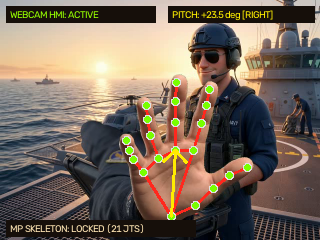
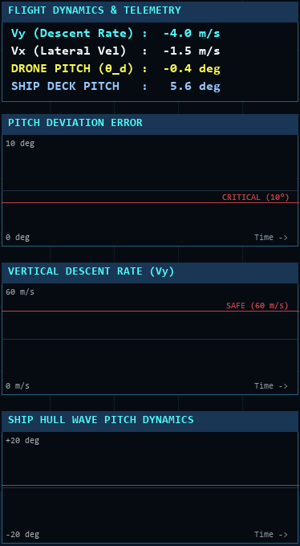

# MASS-eVTOL Autonomous Landing Simulator

## 조종사 신체 연동 3자유도 제어 기반 해상 특수목적 비행체 착함 시뮬레이터
본 프로젝트는 해상 불규칙 파랑 환경에서 자율운항 선박(MASS)과 특수목적 비행체(eVTOL) 간의 안정적인 착함을 실시간으로 모사하는 비행 제어 및 물리 시뮬레이션 시스템입니다.

---

## 1. 2자유도 대비 3자유도 신체 연동 착함의 핵심 가치

일반적인 무인 비행체 수동 착륙 방식은 수평 이동(x)과 수직 강하(y)만을 고려하는 2자유도(2-DoF) 제어에 머물러 있습니다. 평탄한 육상 헬리패드에서는 기체가 수평(Pitch 0도)을 유지한 채 하강해도 안전하지만, 파도로 인해 갑판이 10도 이상 기울어지는 해상 환경에서는 문제가 발생합니다.

기체가 기울어지지 않고 수평(Pitch 0도)을 유지한 채 하강할 때, 화면의 파란색 선(선체 표면 목표 각도선)은 선체 갑판의 순간 기울기와 동기화되어 크게 기울어집니다. 이 상태로 착함하면 한쪽 스키드만 먼저 접촉하여 허용 각도 편차(10도)를 초과하게 되며, 전복(Roll-over) 충돌 사고로 직결되어 실패 판정됩니다.

반면 조종사가 웹캠 비전 HMI를 통해 직접 손을 기울이면, 비행체 동체가 파란색 기준선(선체 표면 각도)과 1:1로 완벽히 일치하도록 회전하여 요동치는 갑판과 평행을 이룹니다. 그 결과 양쪽 스키드가 갑판에 균등하고 안전하게 동시 안착하여 충돌 없이 착함에 성공합니다.

<div align="center">
  
  <p>[비교 시연] 2-DoF 착함(드론 수평 고정 및 파란색 선과 불일치로 인한 전복 충돌) 대비 3-DoF 조종사 연동 착함(파란색 선 및 갑판 각도 일치 안착)</p>
</div>

| 비교 항목 | 일반 2자유도(2-DoF) 착함 | 제안된 신체 연동 3자유도(3-DoF) 착함 |
|:---|:---|:---|
| 제어 자유도 | 수평 위치 x, 수직 위치 y | 수평 위치 x, 수직 위치 y, 기체 피치 각도 theta |
| 기체 동체 각도 | 수평(0도) 고정 하강 | 조종사 손목 틸트 각도에 맞춰 파란색 선과 1:1 동기화 |
| 파란색 선 (선체 표면 기준선) | 선체 각도와 동기화되나 기체와 불일치 | 기체 동체와 완벽히 평행하게 정렬 |
| 파랑 갑판 접지 시 | 한쪽 스키드 편하중 충돌 및 기체 전복 실패 | 갑판 기울기와 완전 평행 정렬 후 양쪽 동시 접지 성공 |
| 해상 착함 성공률 | 저조 (허용 각도 편차 10도 초과 빈발) | 우수 (실시간 갑판 요동 즉각 추종 및 충격 완화) |

<div align="center">
  <table>
    <tr>
      <td align="center">2-DoF 착함 실패: 기체 수평 고정으로 파란색 선과 불일치 충돌</td>
      <td align="center">3-DoF 착함 성공: 조종사 직접 제어로 파란색 선 및 갑판 정렬 접지</td>
    </tr>
    <tr>
      <td></td>
      <td></td>
    </tr>
  </table>
</div>

---

## 2. 웹캠 비전 HMI 기반 실시간 조종사 신체 연동 제어

조종사가 웹캠 앞에서 카메라 방향으로 팔을 앞으로 뻗은 상태에서 손목과 손가락을 좌우로 기울이면, 비전 HMI 파이프라인이 실시간으로 조종사의 손목(Landmark 0)과 손가락 21개 관절 스켈레톤을 검출 및 추적합니다.

추출된 조종사의 자세 제어 벡터(노란색 화살표)에 따라 상공의 비행체 동체 피치각이 조종사의 손 움직임과 정확히 동일한 방향(손 우측 틸트 시 드론 우측 기울기, 손 좌측 틸트 시 드론 좌측 기울기)으로 실시간 동기화되어 회전합니다.

<div align="center">
  
  <p>[실시간 제스처 연동] 웹캠 비전 HMI의 실시간 21개 관절 스켈레톤 추적 및 비행체 피치각 1:1 동기화</p>
</div>

<div align="center">
  <table>
    <tr>
      <td align="center">웹캠 비전 HMI: 21-Joint 손 관절 스켈레톤 및 제어 벡터 검출</td>
      <td align="center">3자유도 신체 연동 착함 시뮬레이터 전체 관제 화면</td>
    </tr>
    <tr>
      <td></td>
      <td></td>
    </tr>
  </table>
</div>

---

## 3. 실시간 3채널 비행 텔레메트리 그래프 및 안전 접지 기준

시뮬레이터 좌측 패널에는 비행체의 동역학적 상태와 선박의 파랑 거동을 실시간으로 감시할 수 있는 3채널 시계열 그래프 모듈이 탑재되어 있습니다.

<div align="center">
  
  <p>[실시간 텔레메트리 패널] 피치 오차 감시, 수직 하강율 계측, 선체 파랑 요동 그래프 실시간 갱신</p>
</div>

| 채널 | 모듈 명칭 | 계측 데이터 및 한계선 | 기술적 목적 |
|:---:|:---|:---|:---|
| CH 1 | PITCH DEVIATION ERROR | 기체와 선체 간 각도 편차 (한계선: 10도) | 자세각 동기화 수렴 상태 실시간 감시 |
| CH 2 | VERTICAL DESCENT RATE | 수직 하강 속도 Vy (한계선: 60 m/s) | 하강율 제어 및 충격 완화 계측 |
| CH 3 | SHIP HULL WAVE PITCH | 선체 피칭 동역학 (-20도 ~ +20도) | 파랑 주기에 따른 갑판 거동 예측 |

선박 갑판의 동적 경계면과 비행체 하단 스키드 간의 실시간 교차 연산을 수행하여 다음의 항공 안전 기준에 따라 안착 여부를 자동 판정합니다.

| 판정 항목 | 안전 착함 허용 기준 (SAFE) | 충돌 판정 기준 (CRASH) | 판정 메커니즘 |
|:---|:---:|:---:|:---|
| 수직 하강 속도 (Vy) | 60.0 m/s 이하 | 60.0 m/s 초과 | 기체 랜딩기어 및 선체 파손 방지 한계 |
| 선체-기체 각도 편차 | 10.0도 이하 | 10.0도 초과 | 갑판 접지 시 기체 전복 방지 한계 |

---

## 4. FCS 자율 착륙 시스템

비행 중 T 키를 누르면 수동 비행에서 자율 착륙 모드로 전환됩니다. FCS는 선박 헬리패드 중심 좌표와 데크의 실시간 법선 각도를 추적하여 위치 오차와 각도 오차를 실시간으로 0에 수렴시킵니다.

<div align="center">
  
  <p>[FCS 자율 착륙 모드] 요동치는 선박 데크의 헤브 및 피칭 운동을 실시간 추적하여 안전 하강 및 안착</p>
</div>

---

## 5. 수학적 모델링 및 제어 수식

### 파랑 및 선체 거동 모델
선체의 상하 요동(Heave)과 종동요(Pitch)는 복수의 조화함수 중첩으로 모델링됩니다.

$$y_{heave}(t) = \sum_{i=1}^{N} A_i \sin(\omega_i t + \phi_i)$$

$$\theta_{pitch}(t) = A_{\theta} \sin(\omega_{\theta} t + \phi_{\theta})$$

- A1 = 35.0 m, omega1 = 1.3 rad/s, phi1 = 0.0
- A2 = 12.0 m, omega2 = 2.7 rad/s, phi2 = 1.1
- A_theta = 14.0 deg, omega_theta = 0.8 rad/s, phi_theta = 0.4

선박 데크 양 끝단 (x1, y1), (x2, y2)의 순간 좌표는 선체 중심 (xc, yc)과 데크 폭 L_deck = 250 px에 의해 결정됩니다.

$$x_1(t) = x_c - \frac{L_{deck}}{2} \cos(\theta_{pitch}(t)), \quad y_1(t) = y_c - \frac{L_{deck}}{2} \sin(\theta_{pitch}(t))$$

$$x_2(t) = x_c + \frac{L_{deck}}{2} \cos(\theta_{pitch}(t)), \quad y_2(t) = y_c + \frac{L_{deck}}{2} \sin(\theta_{pitch}(t))$$

### 3자유도 비행 역학
비행체에 작용하는 순 가속도 (ax, ay)와 공기 저항 감쇠율(eta = 0.95)은 다음과 같이 적분됩니다.

$$a_x(t) = F_x(t), \quad a_y(t) = g + F_y(t) \quad (g = 40.0\text{ m/s}^2)$$

$$V_x(t + \Delta t) = (V_x(t) + a_x(t)\Delta t) \cdot \eta$$

$$V_y(t + \Delta t) = (V_y(t) + a_y(t)\Delta t) \cdot \eta$$

$$x(t + \Delta t) = x(t) + V_x(t)\Delta t, \quad y(t + \Delta t) = y(t) + V_y(t)\Delta t$$

### FCS 피드백 제어 법칙
자율 착륙 모드 시, 선박 데크 타깃과의 오차에 비례-미분 제어를 적용합니다.

$$e_x(t) = x_{ship}(t) - x_{drone}(t)$$

$$e_y(t) = (y_{ship}(t) - h_{offset}) - y_{drone}(t)$$

$$e_\theta(t) = \theta_{ship}(t) - \theta_{drone}(t)$$

$$a_x(t) = K_{p,x} \cdot e_x(t) - K_{d,x} \cdot V_x(t) \quad (K_{p,x} = 2.0, K_{d,x} = 1.0)$$

$$a_y(t) = K_{p,y} \cdot e_y(t) - K_{d,y} \cdot V_y(t) \quad (K_{p,y} = 3.0, K_{d,y} = 1.5)$$

$$\dot{\theta}_{drone}(t) = K_{p,a} \cdot e_\theta(t) \quad (K_{p,a} = 5.0)$$

### MediaPipe 제스처 벡터 각도 변환
손목(Landmark 0)과 중지 기저부(Landmark 9)의 정규화 좌표 (x0, y0), (x9, y9)로부터 제어 각도를 추출합니다.

$$\Delta x = x_9 - x_0, \quad \Delta y = y_9 - y_0$$

$$\theta_{raw} = \arctan2(\Delta y, \Delta x) \cdot \frac{180}{\pi}$$

$$\theta_{tilt} = \text{clamp}(\theta_{raw} + 90^\circ, -45.0^\circ, +45.0^\circ)$$

수동 조종 모드 시 비행체 피치 각도는 지수 평활 필터를 통해 동기화됩니다.

$$\theta_{drone}(t + \Delta t) = \theta_{drone}(t) + 0.14 \cdot (\theta_{tilt} - \theta_{drone}(t))$$

---

## 6. 조작키 및 입력 안내

| 조작키 / 입력 | 기능 설명 | 세부 동작 |
|:---:|:---|:---|
| W | 상승 추력 | 누르고 있을수록 추력 배율이 1.0배에서 최대 3.5배까지 가속 |
| S | 하강 보조 | 하강 방향 가속도 적용 |
| A | 좌측 이동 | 좌측 방향 가속도 적용 |
| D | 우측 이동 | 우측 방향 가속도 적용 |
| T | 자율/수동 모드 전환 | 수동 조종 모드와 자율 착륙 FCS 모드 상호 전환 |
| 웹캠 손 제스처 | 3자유도 피치 직관 조종 | 손을 좌우로 기울여 비행체 각도 동기화 제어 |
| 창 닫기 / ESC | 시뮬레이터 종료 | 비디오 및 렌더링 리소스 안전 해제 |

---

## 7. 설치 및 실행 가이드

### 1. 저장소 클론
```bash
git clone https://github.com/hi-shp/eVTOL-landing.git
cd eVTOL-landing
```

### 2. 의존성 라이브러리 설치
Python 3.10 이상 환경을 권장합니다.

```bash
pip install pygame opencv-python mediapipe numpy pillow matplotlib
```

### 3. 시뮬레이터 실행
```bash
python main.py
```

웹캠이 연결되어 있으면 조종사의 실시간 손 관절 제스처를 즉각 인식하여 비행체 피치 제어에 반영합니다. 웹캠이 없는 환경에서도 내장된 실시간 제스처 피드 파이프라인(`assets/pilot_gesture_feed.mp4`)을 통해 MediaPipe Hands 21개 관절 스켈레톤 추적 및 3자유도 착함 기능이 완벽하게 실시간 구동됩니다.
